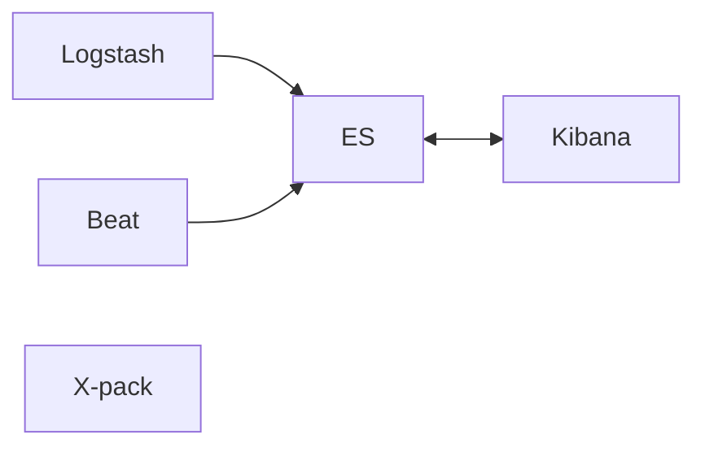

# Introduction
* A database that holds data and allow advanced efficient searching.
* An analytic and search engine.
* Allows different search methods, like text, search relevance, sorting result.
* Query and analyze structured data.
* It scales easily with data volumes and query throughput.

Table is known as ***Index***
Data is stored as ***Documents*** (= row in SQL)
Document data in ***Fields*** (= columns in SQL)

| Terminology                                          |
| ---------------------------------------------------- |
| Elasticsearch (ES)                                   |
| ELK = Elasticsearch, Logstash, Kibana                |
| Elastic Stack = Superset of ELK, which also has Beat |

## Kibana
* UI dashboard to visualize the elasticsearch data/result
* Analyze the data with different visualization
* It can request data from Elasticsearch

## Logstash
* An event processing pipeling
* Process logs from applications, send to Elasticsearch
* Input (different types of data, log files, computer stats file, json data) ->
* Filter (how to process different types of data as an event, how to read json, xml or other formats) ->
* Output (where to stash the data, Elasticsearch, Kafka queue, HTTP endpoints, etc)
* e.g. a line of log can be translate to an event formatted to json by specific processor

## X-Pack
Additional features for Elasticsearch and Kibana
* Security (authentication / authorization, control user permission)
* Monitoring (performance of Elastic Stacks, CPU usage)
* Alerting (CPU usage, disk space, customer request. by e-mail, Slack, other applications)
* Reporting (export Kibana visualization data, schedule report generation)
* Machine Learning (abnormality detection, forecasting)
* Graph (analyze relationship of data, suggest relevance data)
* Elasticsearch SQL (can use SQL instead of use Query DSL (json))

## Beats
* Data shippers - send data to Logstash/ES
* Filebeat - collect logs and send to Logstash/ES
* Metricbeat - collect system and service statistic
